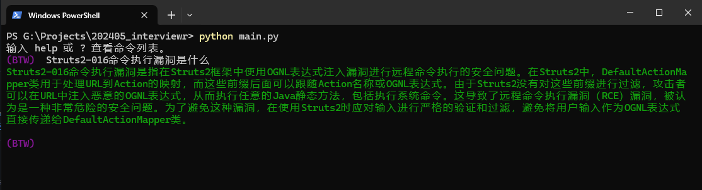

# RAG4Sec

## 基于LLM进行检索增强式的安全知识库管理



## 需求

- Python >=3.9+
- Ollama >=0.3.18
- Langchain
- pytorch + cuda
- BAAI/bge嵌入模型


## 用法
    
    ```bash
    python main.py
    add ./docs/xxxxx.md
    add ./docs/xxxxx.pdf
    进行提问
    ```

    
代码待完善